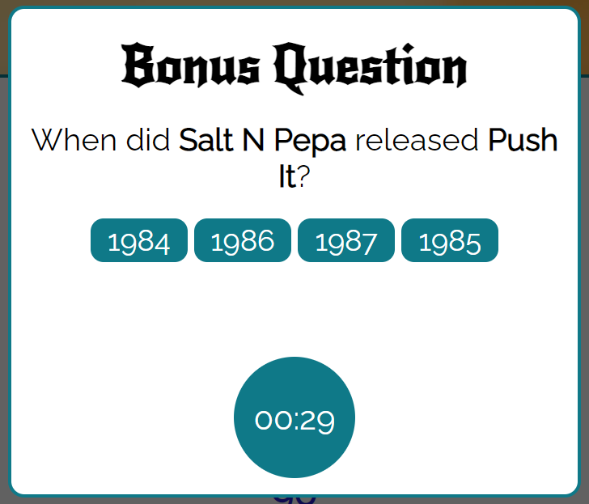

#  Guess The Song

[Play deployed game here](https://daisy-mcg.github.io/Guess-The-Song/)

## Concept

Guess The Song by Team 11 is a musical quiz designed for the Code Institute November 2020 Hackathon "Hackathon Hero". Listen to the music clip, type your answer, try to get as many questions as possible right before you loose all 3 of your lives. 


## How to play

1. In the main page click on Start Game to go to the game page.
2. Select the genre you would like to guess agains. The options are Rock, Pop and Country. You can also play trying to guess all genres.
3. Press the start button to start the game.
4. Press the play button to play the song.
5. You have 60 seconds to type the name of the song playing in the answer box and submit it.
6. If you guess the answer, a bonus question will appear. This will score additional points if guessed correctly.
7. The quicker the answer, the more points you get.
8. You have 3 lives before the game ends.

## Wireframes / Design

### Mobile Concept Designs


### Tablet Concept Designs


### Desktop Concept Designs


### Design

A consistent style was maintained throughout using CSS root variables
```css
:root {
    /* --background: #f79808; */
    --background: #0f7988;
    --buttoncolor: #2b78e4;
    --textcolor: #eeffdd;
    --bordercolor: #000;
    --iconcolor: #4D4D4D;
}
```

## Development

### Spotify API
The main functionality is provided by a JSON file. This utilises the song ID and the Spotify API to serve the song file directly from Spotify to the HTML page:
```js
let checkSong = () => {
  // currentSong.id = 3
  fetch(`https://kareoke.p.rapidapi.com/v1/song/spotify?id=${currentSong.id}`)
    .then((jsonData) => jsonData.json())
    .then((data) => songExists(data));
};
```
Functionality is included to check that the song ID is still valid before fetching from Spotify, if invalid it moves onto the next ID in the JSON file:
```js
const songExists = (song) => {
  if (song.msg === `We couldn't find a data with this id`) {
    getSong();
  }
};
```

### Username Validation

Javascript validation prevents a null value being entered for the Username value. The player is given feedback that this cannot be left blank. 


Whitespace is handled efficiently so that only spaces before and after are stripped away:
```js
  //get username
  userName = document.getElementById("user-name").value;
  // remove white space before and after
  userName = userName.replace(/^\s+|\s+$/gm, "");
  ```

  ### Genre Selection

  The option to select song genres was included to give the game more functionality. This is handled by categorising within the JSON file.

  

  As an extra feature, the background of the game screen changes with the selected category.
  ```js
    let main = document.getElementById("game-background");
  if (genre === "Rock") {
    main.style.backgroundImage = "url('assets/images/drummer.jpg')";
  } else if (genre === "Pop") {
    main.style.backgroundImage = "url('assets/images/disco-ball.jpg')";
  } else if (genre === "Country") {
    main.style.backgroundImage = "url('assets/images/guitar.jpg')";
  }
  ```

  ### Timer

  To keep the game flowing and improve the user experience, a countdown timer was added to each question. This is displayed on screen so it is clear to see how much time is left to answer the question. Colours on the timer change as your time runs out. 

  ```js
  function setRemainingPathColor(timeLeft) {
  const { alert, warning, info } = COLOR_CODES;
  if (timeLeft <= alert.threshold) {
    document
      .getElementById("base-timer-path-remaining")
      .classList.remove(warning.color);
    document
      .getElementById("base-timer-path-remaining")
      .classList.add(alert.color);
  } else if (timeLeft <= warning.threshold) {
    document
      .getElementById("base-timer-path-remaining")
      .classList.remove(info.color);
    document
      .getElementById("base-timer-path-remaining")
      .classList.add(warning.color);
  }
}
```


### Answer Checking

To account for differing input of answers and special characters contained in the answer strings, some validation is included before comparing the input with the correct answer. This compares both fully lower case strings, and ignores any special characters. 
```js
  // Strip special characters from answers
  const stripAns = answer.replace(/[^a-z0-9]/gi, "").toLowerCase();
  let actualAns = currentSong.title.toLowerCase();
  actualAns = actualAns.replace(/[^a-z0-9]/gi, "");
  ```

### Bonus Questions

When a question is answered correctly, an extra modal pops up allowing the player to answer a bonus question for extra points. 


```js
 document.getElementById("base-timer-label").innerText = "01:00";
  let header = document.querySelector("header");
  let bonus = document.createElement("div");
  bonus.setAttribute("id", "bonus");
  document.body.insertBefore(bonus, header);
  let bonusLevel = `
    <div id="overlay">
        <div class="modal">
            <h2>Bonus Question</h2>
            <h3>When did <span>${artist}</span> released <span>${title}</span>?</h3>
            <div class="button-container">
                <button class="bonus-btn">${addAPossibleYear(possible_dates)}</button>
                <button class="bonus-btn">${addAPossibleYear(possible_dates)}</button>
                <button class="bonus-btn">${addAPossibleYear(possible_dates)}</button>
                <button class="bonus-btn">${addAPossibleYear(possible_dates)}</button>
            </div>
            <div id="bonus-timer"><span>${formatTime(bonusCount)}</span></div>
        </div>
    </div>`;
  bonus.innerHTML = bonusLevel;
  ```
### Lives

Players have 3 lives, these are lost by running out of time or submitting an incorrect answer. Lives lost are displayed visually on screen for players as the game progresses. 

```js
const removeLife = () => {
  livesLeft -= 1;
  let lives = document.getElementsByClassName("life");
  if (livesLeft === 2) {
    lives[1].src = `assets/images/skull-red.svg`;
  } else if (livesLeft == 1) {
    lives[2].src = `assets/images/skull-red.svg`;
  } else {
    window.location.href = "scoreboard.html";
  }
  ```


### Scoring

Points scored are higher the quicker you answer the question, with bonus points available for correctly answered bonus questions. 
```js
const incrementScore = (score) => {
  let currentScore = parseInt(document.getElementById("score").innerHTML);
  //ads 50 points per question + one second per extra second
  currentScore += 50 + score;
  document.getElementById("score").innerHTML = currentScore;
  localStorage.score = currentScore;
};
```

Throughout the game, your score is shown and updated on screen within the question box.


## Deployment

The site was deployed to GitHub pages. The steps to deploy are as follows: 
  - In the [GitHub repository](https://github.com/Daisy-McG/Guess-The-Song), navigate to the Settings tab 
  - From the source section drop-down menu, select the **Main** Branch, then click "Save".
  - The page will be automatically refreshed with a detailed ribbon display to indicate the successful deployment.

[The live link can be found here](https://daisy-mcg.github.io/Guess-The-Song/)

### Local Deployment

In order to make a local copy of this project, you can clone it. In your IDE Terminal, type the following command to clone my repository:

- `git clone https://github.com/Daisy-McG/Guess-The-Song.git`

Alternatively, if using Gitpod, you can click below to create your own workspace using this repository.

[](https://gitpod.io/#https://github.com/Daisy-McG/Guess-The-Song)

## Testing

### Validators

All files passed through official JS validator:

**modal.js**


**score.js**


**game.js**


All files passed through official CSS validator:
* index.css
* game.css
* scoreboard.css


All files passed through official HTML validator:
* index.html
* game.html
* scoreboard.html


### Browsers

The game has been tested and played in :

#### Chrome


#### Edge


#### Safari


## Credits

### Images

* Image of rock band on main game screen taken from - [PixaBay](https://pixabay.com/photos/guitar-guitarist-music-756326/)
* Scoreboard background image from [PixaBay](https://pixabay.com/photos/concert-microphone-bandstand-music-7424190/)
* Pop genre background image taken from - [Pexels](https://www.pexels.com/photo/silver-disco-ball-593467/)
* Rock genre background image taken from - [Pexels](https://www.pexels.com/photo/person-playing-drums-1475021/)
* Initial game background image taken from - [Pexels](https://www.pexels.com/photo/people-at-concert-1105666/)
* [Favicon from this Font Awesome project](https://gauger.io/fonticon/)
### Code

* No Cheating - Console log styling taken from [Stack Overflow](https://stackoverflow.com/questions/26283936/stylized-console-logging) post, inspired by facebook
* [Local data storage for scoreboard from w3Schools](https://www.w3schools.com/js/js_api_web_storage.asp)
* [Google Fonts](https://fonts.google.com/)

### Development done by:

* [Agustin](https://github.com/cilliagustin)
* [Carlos](https://github.com/felipesandoli)
* [Cheryl](https://github.com/ccp84)
* [Claire](https://github.com/Claire221)
* [Daisy](https://github.com/Daisy-McG)
* [Mark](https://github.com/mark279455)
